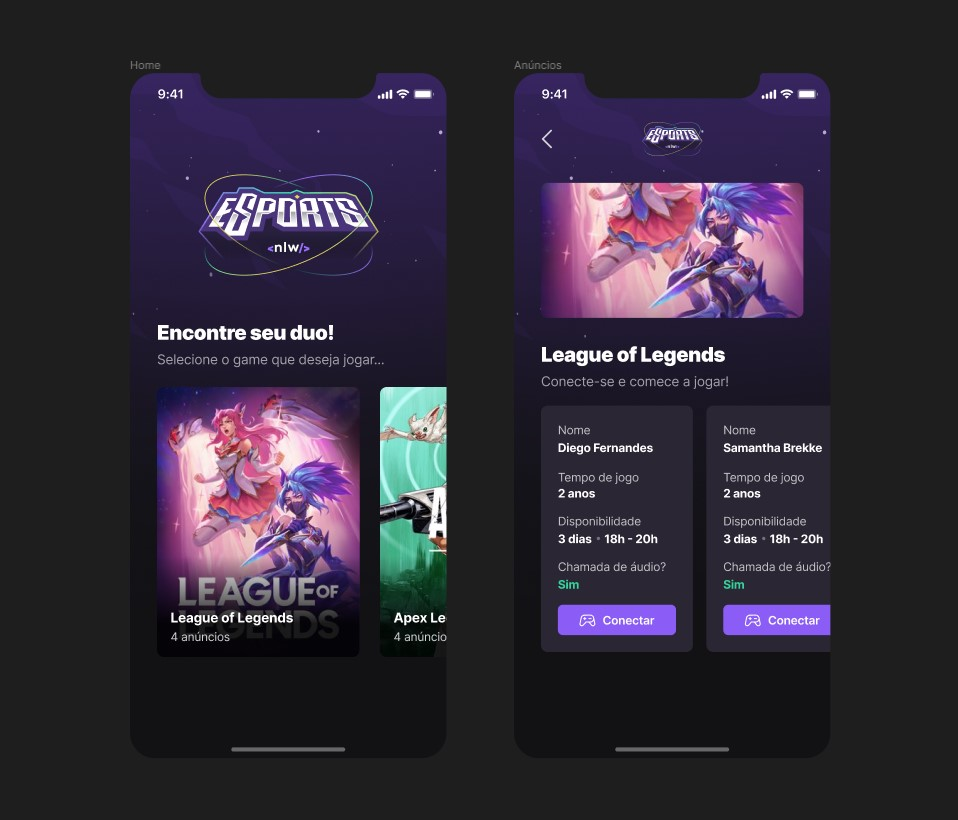

# NLW eSports Mobile

This project was bootstrapped with [Expo](https://expo.dev/).

## To test this project

In the project directory, to download the app dependencies you can run

### `npm install`

### `yarn`

Then to start running the project run

### `npx expo start`

The app will run in the development mode.\
To test the app you need to instal [ExpoGo](https://apps.apple.com/us/app/expo-go/id982107779) and scan the QRCODE in the screen

The page will reload when you make changes.\
You may also see any lint errors in the console.